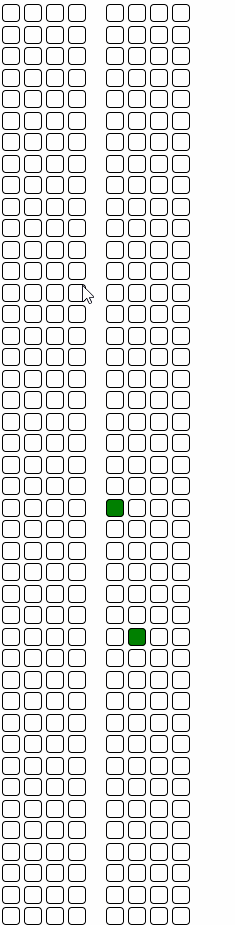

# Advent of Code 2020

https://adventofcode.com/2020

Highlights of this year:

- Day 3: rendered the landscape, and then used jQuery to identify which trees would be hit on the sled from an element's CSS class. Not a particularly sensible approach, but an interesting challenge. Also had a snazzy visualisation:

- Day 4: Good adherence to open/closed principle by making generic validators.

- Day 5: another nice visualisation.

- Day 6: pure TDD.

- Day 10: An interesting mathematical challenge, which had a neat solution using Tribonnaci numbers.